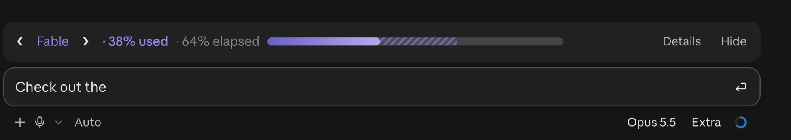
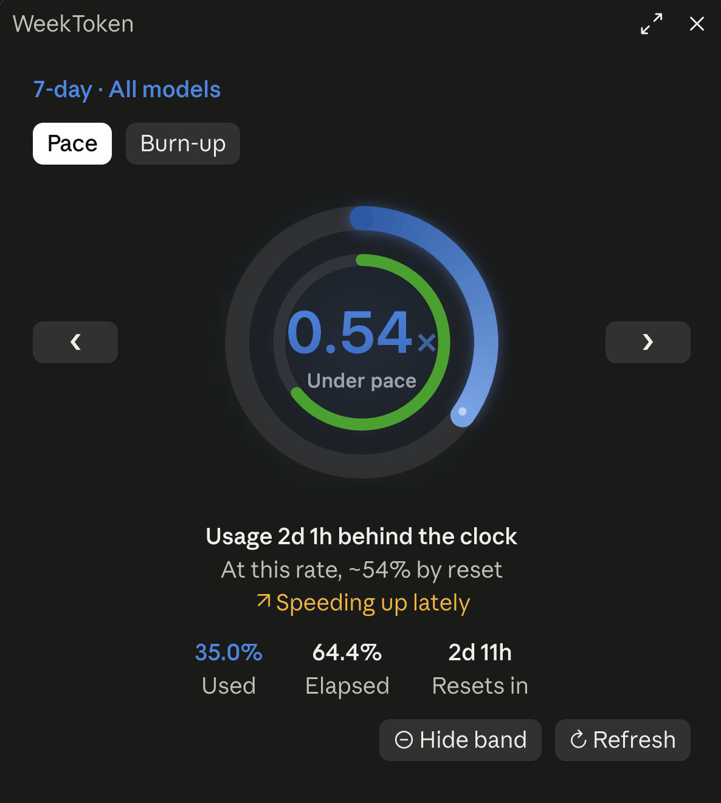
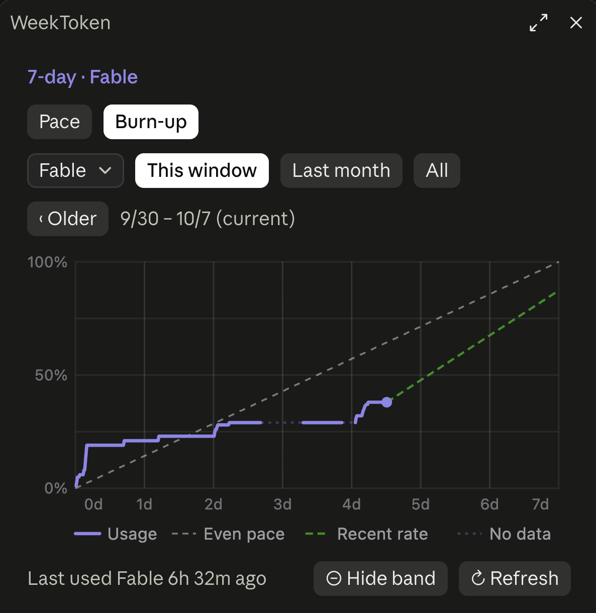
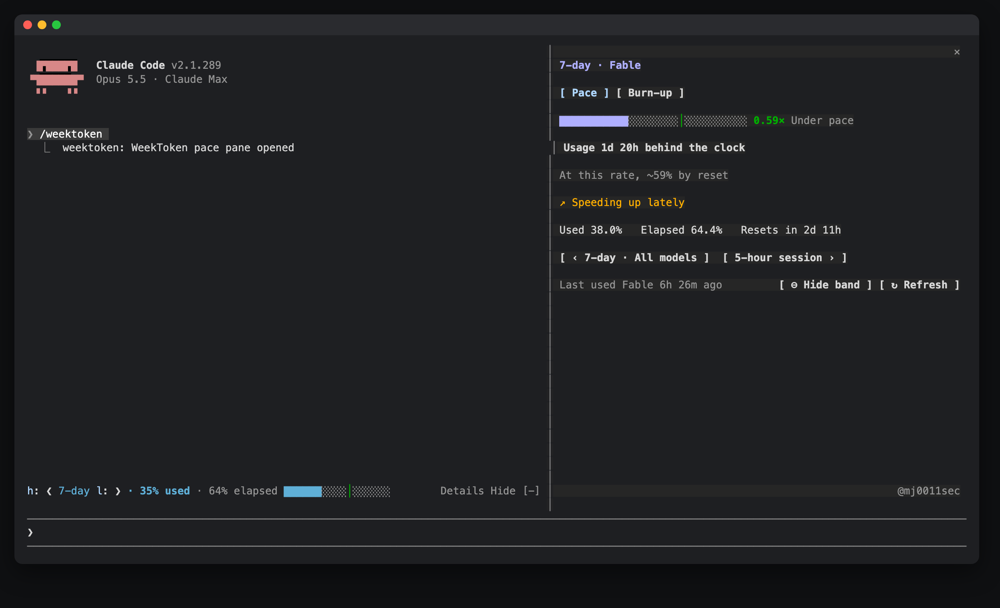

# WeekToken

English · [简体中文](./README.zh-CN.md)

**Will you run out before the reset?** WeekToken puts what you have **used** of Claude Code's rate limits next to how much of the window has **passed**, and tells you whether you are ahead of the clock or behind it. It covers the 5-hour window, the 7-day window and **per-model weekly quotas such as Fable**.



- **Pace, not just a percentage.** 64% used means little on its own; 64% used with 71% of the week gone means you are fine. The band and the pane show both, colored by pace.
- **Per-model quotas.** Fable and other models with a weekly limit of their own get their own pace, next to the 5-hour and 7-day windows.
- **A forecast and a history.** "At this rate, runs out ~Sat 20:12", plus a burn-up chart that lays past windows under this one, so you can see how this week compares.
- **Nothing to set up.** No settings; English or Chinese, following Claude Code's language; desktop app and terminal.

| `/weektoken` pace | Burn-up history |
| --- | --- |
|  |  |

In the terminal, the band sits above the prompt and `/weektoken` docks beside the conversation:



## Features

**A band above the prompt:** `❮ 7-day ❯ · 64% used · 71% elapsed`, a progress bar that stretches with the band, plus **Details** and **Hide** (in the desktop app, Hide is the close button at the band's right end).
- The bar stays in the quota's own color, like Apple's Activity rings. Using slower than time: light stripes of that color after the bar are the margin you have left. Using faster: the part ahead of the clock turns a deeper shade of the same color, striped. Only when a quota is used up does a warm tone appear, harmonized toward the quota's color.
- Shows the tightest quota by default. The arrows around the name switch to another quota, and the choice is remembered across sessions.
- On a narrow band the line never wraps: the desktop app truncates from the end; in the terminal the line is laid out by its real width, dropping the elapsed figure first and then the bar.
- When a quota's window has passed its reset time and no reading of the new window has arrived yet, the band says **reset** instead of showing the old window's usage.
- **Hide** asks first and tells you how to get the band back: `/weektoken show`, or **⊕ Show band** at the bottom of the pane.

**The `/weektoken` pane:**
- Pace rings: the outer ring is usage, the inner ring is time, and the center is the burn rate R (1.0 means you run out exactly at reset). The buttons on either side switch between the 5-hour window, the 7-day window and per-model quotas such as Fable.
- Narration and forecast, e.g. "Usage 12h 28m behind the clock", "At this rate, runs out ~Sat 20:12"; an extra line when you have been speeding up or slowing down lately.
- Three readings: used, elapsed, time to reset.
- Burn-up chart: this window, the last month or everything, with older windows a step away; an even-pace line, the projection at the recent rate, when you would run out, and stretches without data, with the legend drawn inside the chart. When a range holds more than 60 windows, 60 evenly spaced ones are drawn and the caption says so.
- Footer: "Last used Fable 3h ago" when a quota has not moved for half an hour, **⊖ Hide band / ⊕ Show band** and **↻ Refresh**. While refreshing, the button reads **Refreshing…**; a notice appears only if `/usage` could not run.

**Colors follow pace, not the raw percentage:** the over-pace thresholds are Claude Code's own rate-limit warning calibration (`five_hour`: 0.9/0.72; `seven_day`: 0.25/0.15, 0.5/0.35, 0.75/0.6) and tighten as the window goes on.

## Where the data comes from

| Source | Content |
|---|---|
| The session's own rate limits | The 5-hour and 7-day windows, updated after every reply |
| `cachedUsageUtilization` in `~/.claude.json` | Claude Code's own usage cache, including per-model quotas (Fable and others) |
| Local `claude -p --no-session-persistence /usage` (only when you press **↻ Refresh**) | Fresh per-model quotas; also the 5-hour and 7-day windows when there is no local reading from the last 10 minutes (a new session before its first reply) |
| `~/.weektoken/samples.jsonl` (optional) | History from the WeekToken macOS app, imported read-only |

Samples are kept in the mod's own cross-session store, up to 8000; the oldest go first. Sessions open at the same time merge their samples and keep one copy of each reading. Without history to import from the WeekToken macOS app, history starts when you install the mod, since the API only reports current values.

A quota you are not using does not change, so old data still gives a valid pace.

## Commands

| Command | Does |
|---|---|
| `/weektoken` | Opens the pace pane |
| `/weektoken hide` | Hides the band (kept across sessions) |
| `/weektoken show` | Shows it again |

## Configuration

Nothing to configure. Two environment variables override the defaults; set them in your shell profile (e.g. `~/.zshrc`) and start a new session:

| Variable | Effect |
|---|---|
| `WEEKTOKEN_LANG` | `zh` or `en` forces the interface language. By default it follows Claude Code's language setting, then the system language |
| `WEEKTOKEN_HISTORY` | Path of the WeekToken macOS app's history file; an empty string turns the import off |
| `CLAUDE_MODS_DISABLE` | `all`, or a comma list containing `weektoken`, turns the mod off entirely |

## Privacy and permissions

Mods run with the same access as Claude Code itself and are not sandboxed. Everything this mod touches:

- **Reads** the session's usage figures (`session.measure`, `$.session.usage`), the time and model of each reply (`turn.complete`, to tell when a quota was last used), Claude Code's `language` setting, and the environment variables `HOME`, `LANG`/`LC_*`, `WEEKTOKEN_LANG`, `WEEKTOKEN_HISTORY` and `CLAUDE_MODS_DISABLE`.
- **Reads files:** `~/.claude.json`, parsed whole but only its `cachedUsageUtilization` entry is used (when the file is over 4 MiB and cannot be read, `perl` extracts just that entry); `~/.weektoken/samples.jsonl` if it exists (the last 8000 lines, via `tail`).
- **Runs:**
  - `defaults read -g AppleLanguages`, to read the macOS language.
  - `tail` and `perl`, as above.
  - Only when you press **↻ Refresh**: `claude -p --no-session-persistence /usage`, Claude Code's own local command, which looks up usage with your own login. It calls no model, uses no quota and saves no session (checked with `--debug-file`: it only requests the usage endpoint).
- **Stores** in the mod's own store: samples (up to 8000) and their version stamp, when each model was last used, whether the band is shown and which quota it shows, the quota selected in the pane, the modification time of the imported history file, and whether the welcome notice was shown. The interface language is detected each session, not stored.
- The mod itself **makes no network calls and sends no data anywhere**.

## Requirements

- Claude Code 2.1.287 or newer, where mods are on by default. On an earlier build with mods in early access, add `"env": { "CLAUDE_CODE_ENABLE_FUNCTION_HOOKS": "1" }` to `~/.claude/settings.json` first
- A Claude subscription; sessions billed by API key have no rate limits

## Development

```bash
claude plugin validate .
claude plugin test
```

## Author

mj0111 · [@mj0011sec](https://x.com/mj0011sec)
